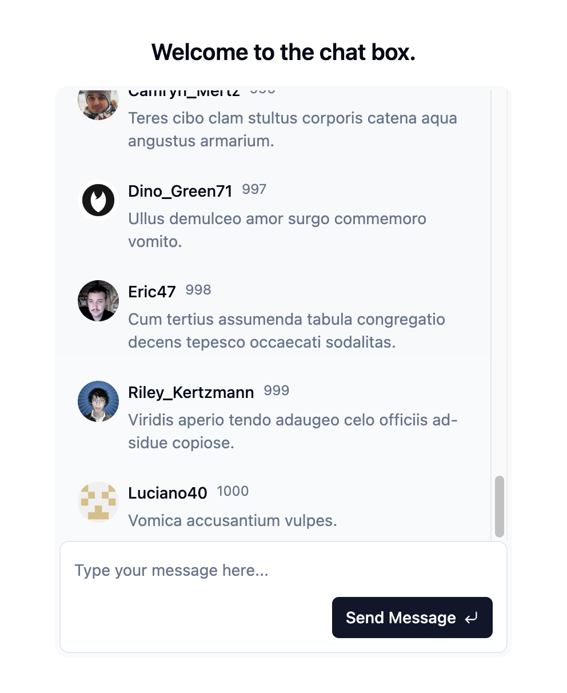

# Chat Box Demo

<p align="center">
  
</p>

## Getting Started

---

Follow the steps below to set up and run the project locally:

### Installation

To install the required dependencies, run:

```bash
npm ci
```

### Running the Development Server

After installation, you can start the development server with:

```bash
npm run dev
```

This will launch the project locally, and you can view it in your browser at `http://localhost:5173`.

## Technologies Used

---

### UI Library

- [shadcn-ui](https://ui.shadcn.com/docs)

### Virtualized List

- [TanStack Virtual](https://tanstack.com/virtual/latest/docs/introduction)
